Effectiveness of HIV treatment combinations - Cox regression with
time-varying covariates feat. `data.table`
================
Brandon Hao, Emmanuel Mnatzaganian, Marcus Di Sipio, Guolin Yu
2023-05-25

In this markdown, we’ll demonstrate how to clean the data for a Cox
regression with time-varying covarites. The data cleaning is arguably
the most difficult part of the the analysis and we’ll make plenty use of
`data.table`’s convenient group-wise operations! We’ll also demonstrate
the process of fitting the Cox regression model and checking if the
proportional hazards assumption of the model is met.

Without further ado, let’s load in the necessary packages and read in
the data.

``` r
# Install and load libraries 
packages <- c('tidyverse', 'data.table', 'survival', 'DataExplorer', 'survsim', 'broom', 'survminer')

installed_packages <- packages %in% rownames(installed.packages())

if (any(installed_packages == FALSE)) {
  install.packages(packages[!installed_packages])
}

invisible(lapply(packages, require, character.only = TRUE))
```

    ## Loading required package: tidyverse

    ## Warning: package 'tidyverse' was built under R version 4.2.3

    ## Warning: package 'ggplot2' was built under R version 4.2.3

    ## Warning: package 'readr' was built under R version 4.2.3

    ## Warning: package 'lubridate' was built under R version 4.2.3

    ## ── Attaching core tidyverse packages ──────────────────────── tidyverse 2.0.0 ──
    ## ✔ dplyr     1.1.0     ✔ readr     2.1.4
    ## ✔ forcats   1.0.0     ✔ stringr   1.5.0
    ## ✔ ggplot2   3.4.2     ✔ tibble    3.1.8
    ## ✔ lubridate 1.9.2     ✔ tidyr     1.3.0
    ## ✔ purrr     1.0.1

    ## ── Conflicts ────────────────────────────────────────── tidyverse_conflicts() ──
    ## ✖ dplyr::filter() masks stats::filter()
    ## ✖ dplyr::lag()    masks stats::lag()
    ## ℹ Use the ]8;;http://conflicted.r-lib.org/conflicted package]8;; to force all conflicts to become errors
    ## Loading required package: data.table
    ## 
    ## 
    ## Attaching package: 'data.table'
    ## 
    ## 
    ## The following objects are masked from 'package:lubridate':
    ## 
    ##     hour, isoweek, mday, minute, month, quarter, second, wday, week,
    ##     yday, year
    ## 
    ## 
    ## The following objects are masked from 'package:dplyr':
    ## 
    ##     between, first, last
    ## 
    ## 
    ## The following object is masked from 'package:purrr':
    ## 
    ##     transpose
    ## 
    ## 
    ## Loading required package: survival
    ## 
    ## Loading required package: DataExplorer

    ## Warning: package 'DataExplorer' was built under R version 4.2.3

    ## Loading required package: survsim

    ## Warning: package 'survsim' was built under R version 4.2.3

    ## Loading required package: eha
    ## Loading required package: statmod

    ## Warning: package 'statmod' was built under R version 4.2.3

    ## Loading required package: broom

    ## Warning: package 'broom' was built under R version 4.2.3

    ## Loading required package: survminer
    ## Loading required package: ggpubr

    ## Warning: package 'ggpubr' was built under R version 4.2.3

    ## 
    ## Attaching package: 'survminer'
    ## 
    ## The following object is masked from 'package:survival':
    ## 
    ##     myeloma

``` r
# Set file paths  
if (!dir.exists('output')) dir.create(file.path('output'))

# Read HIV data
hiv <- file.path(r'{../input/HealthGymV2_CbdrhDatathon_ART4HIV.csv}') %>% fread()
```

Let’s have a look at our dataset.

``` r
# Quick look! 
glimpse(hiv)
```

    ## Rows: 534,960
    ## Columns: 15
    ## $ VL                <dbl> 29.94427, 29.24198, 28.74899, 28.10184, 28.81384, 28…
    ## $ CD4               <dbl> 793.4583, 467.4189, 465.1248, 692.0069, 641.7571, 44…
    ## $ `Rel CD4`         <dbl> 30.83451, 30.35598, 30.40532, 30.24882, 29.94471, 30…
    ## $ Gender            <dbl> 1, 1, 1, 1, 1, 1, 1, 1, 1, 1, 1, 1, 1, 1, 1, 1, 1, 1…
    ## $ Ethnic            <dbl> 3, 3, 3, 3, 3, 3, 3, 3, 3, 3, 3, 3, 3, 3, 3, 3, 3, 3…
    ## $ `Base Drug Combo` <dbl> 0, 0, 0, 0, 0, 0, 0, 0, 0, 0, 0, 0, 0, 0, 0, 0, 0, 0…
    ## $ `Comp. INI`       <dbl> 0, 0, 0, 0, 0, 0, 0, 0, 0, 0, 0, 0, 0, 0, 0, 0, 0, 0…
    ## $ `Comp. NNRTI`     <dbl> 3, 3, 3, 3, 3, 3, 3, 3, 3, 3, 3, 3, 3, 3, 3, 3, 3, 3…
    ## $ `Extra PI`        <dbl> 5, 5, 5, 5, 5, 5, 5, 5, 5, 5, 5, 5, 5, 5, 5, 5, 5, 5…
    ## $ `Extra pk-En`     <dbl> 0, 0, 0, 0, 0, 0, 0, 0, 0, 0, 0, 0, 0, 0, 0, 0, 0, 0…
    ## $ `VL (M)`          <dbl> 0, 0, 0, 0, 0, 0, 0, 0, 0, 0, 0, 0, 0, 0, 0, 0, 0, 0…
    ## $ `CD4 (M)`         <dbl> 1, 0, 0, 0, 0, 0, 0, 1, 0, 0, 0, 0, 0, 0, 0, 0, 0, 0…
    ## $ `Drug (M)`        <dbl> 1, 1, 1, 1, 1, 1, 1, 1, 1, 1, 1, 1, 1, 1, 1, 1, 1, 1…
    ## $ PatientID         <int> 0, 0, 0, 0, 0, 0, 0, 0, 0, 0, 0, 0, 0, 0, 0, 0, 0, 0…
    ## $ Timestep          <int> 0, 1, 2, 3, 4, 5, 6, 7, 8, 9, 10, 11, 12, 13, 14, 15…

``` r
summary(hiv)
```

    ##        VL                CD4              Rel CD4            Gender     
    ##  Min.   :    0.10   Min.   :    7.96   Min.   :  1.871   Min.   :1.000  
    ##  1st Qu.:   10.49   1st Qu.:  272.85   1st Qu.: 17.462   1st Qu.:1.000  
    ##  Median :   38.78   Median :  466.40   Median : 27.734   Median :1.000  
    ##  Mean   : 7041.12   Mean   :  823.08   Mean   : 36.353   Mean   :1.137  
    ##  3rd Qu.:  778.27   3rd Qu.:  859.44   3rd Qu.: 44.152   3rd Qu.:1.000  
    ##  Max.   :97566.41   Max.   :42475.20   Max.   :586.635   Max.   :2.000  
    ##      Ethnic      Base Drug Combo   Comp. INI      Comp. NNRTI       Extra PI   
    ##  Min.   :1.000   Min.   :0.000   Min.   :0.000   Min.   :0.000   Min.   :0.00  
    ##  1st Qu.:3.000   1st Qu.:0.000   1st Qu.:1.000   1st Qu.:2.000   1st Qu.:5.00  
    ##  Median :4.000   Median :1.000   Median :3.000   Median :3.000   Median :5.00  
    ##  Mean   :3.486   Mean   :1.021   Mean   :2.167   Mean   :2.376   Mean   :4.18  
    ##  3rd Qu.:4.000   3rd Qu.:1.000   3rd Qu.:3.000   3rd Qu.:3.000   3rd Qu.:5.00  
    ##  Max.   :4.000   Max.   :5.000   Max.   :3.000   Max.   :3.000   Max.   :5.00  
    ##   Extra pk-En          VL (M)          CD4 (M)          Drug (M)     
    ##  Min.   :0.00000   Min.   :0.0000   Min.   :0.0000   Min.   :0.0000  
    ##  1st Qu.:0.00000   1st Qu.:0.0000   1st Qu.:0.0000   1st Qu.:1.0000  
    ##  Median :0.00000   Median :0.0000   Median :0.0000   Median :1.0000  
    ##  Mean   :0.06688   Mean   :0.1309   Mean   :0.1552   Mean   :0.7768  
    ##  3rd Qu.:0.00000   3rd Qu.:0.0000   3rd Qu.:0.0000   3rd Qu.:1.0000  
    ##  Max.   :1.00000   Max.   :1.0000   Max.   :1.0000   Max.   :1.0000  
    ##    PatientID       Timestep    
    ##  Min.   :   0   Min.   : 0.00  
    ##  1st Qu.:2229   1st Qu.:14.75  
    ##  Median :4458   Median :29.50  
    ##  Mean   :4458   Mean   :29.50  
    ##  3rd Qu.:6686   3rd Qu.:44.25  
    ##  Max.   :8915   Max.   :59.00

``` r
str(hiv)
```

    ## Classes 'data.table' and 'data.frame':   534960 obs. of  15 variables:
    ##  $ VL             : num  29.9 29.2 28.7 28.1 28.8 ...
    ##  $ CD4            : num  793 467 465 692 642 ...
    ##  $ Rel CD4        : num  30.8 30.4 30.4 30.2 29.9 ...
    ##  $ Gender         : num  1 1 1 1 1 1 1 1 1 1 ...
    ##  $ Ethnic         : num  3 3 3 3 3 3 3 3 3 3 ...
    ##  $ Base Drug Combo: num  0 0 0 0 0 0 0 0 0 0 ...
    ##  $ Comp. INI      : num  0 0 0 0 0 0 0 0 0 0 ...
    ##  $ Comp. NNRTI    : num  3 3 3 3 3 3 3 3 3 3 ...
    ##  $ Extra PI       : num  5 5 5 5 5 5 5 5 5 5 ...
    ##  $ Extra pk-En    : num  0 0 0 0 0 0 0 0 0 0 ...
    ##  $ VL (M)         : num  0 0 0 0 0 0 0 0 0 0 ...
    ##  $ CD4 (M)        : num  1 0 0 0 0 0 0 1 0 0 ...
    ##  $ Drug (M)       : num  1 1 1 1 1 1 1 1 1 1 ...
    ##  $ PatientID      : int  0 0 0 0 0 0 0 0 0 0 ...
    ##  $ Timestep       : int  0 1 2 3 4 5 6 7 8 9 ...
    ##  - attr(*, ".internal.selfref")=<externalptr>

Firstly, the names of the columns suck! Also, there are some variables
which should be categorical variables. Let’s clean up the names and
transform variables into their proper type.

``` r
# Change some names coz they suck
names(hiv) <- c(
  'vl', 'cd4', 'relcd4', 'gender', 'ethnic', 'base_drug_comb', 'ini', 'nnrti', 'pi', 'pk', 'vl_m', 'cd4_m', 'drug_m', 'id', 'time'
  )

# Transform columns into Boolean
boolean_cols <- hiv %>% select(pk:drug_m) %>% names()
hiv[, (boolean_cols) := lapply(.SD, as.logical), .SDcols = boolean_cols]

# Factorise certain columns and give sensible levels
factor_cols <- hiv %>% select(gender:pi) %>% names()
hiv[, (factor_cols) := lapply(.SD, as.factor), .SDcols = factor_cols]

levels(hiv$gender) <- c('male', 'female')
levels(hiv$ethnic) <- c('asian', 'afro', 'caucasian', 'other')
levels(hiv$base_drug_comb) <- c('ftc_tdf','3tc_abc', 'ftc_taf', 'drv_ftc_tdf', 'ftc_rtvb_tdf', 'other') 
levels(hiv$ini) <- c('dtg', 'ral', 'evg', 'not_applied')
levels(hiv$nnrti) <- c('nvp', 'efv', 'rpv', 'not_applied')
levels(hiv$pi) <- c('drv', 'rtvb', 'lpv', 'rtv', 'atv', 'not_applied')

# Make sure the format is properly transformed
str(hiv)
```

    ## Classes 'data.table' and 'data.frame':   534960 obs. of  15 variables:
    ##  $ vl            : num  29.9 29.2 28.7 28.1 28.8 ...
    ##  $ cd4           : num  793 467 465 692 642 ...
    ##  $ relcd4        : num  30.8 30.4 30.4 30.2 29.9 ...
    ##  $ gender        : Factor w/ 2 levels "male","female": 1 1 1 1 1 1 1 1 1 1 ...
    ##  $ ethnic        : Factor w/ 4 levels "asian","afro",..: 3 3 3 3 3 3 3 3 3 3 ...
    ##  $ base_drug_comb: Factor w/ 6 levels "ftc_tdf","3tc_abc",..: 1 1 1 1 1 1 1 1 1 1 ...
    ##  $ ini           : Factor w/ 4 levels "dtg","ral","evg",..: 1 1 1 1 1 1 1 1 1 1 ...
    ##  $ nnrti         : Factor w/ 4 levels "nvp","efv","rpv",..: 4 4 4 4 4 4 4 4 4 4 ...
    ##  $ pi            : Factor w/ 6 levels "drv","rtvb","lpv",..: 6 6 6 6 6 6 6 6 6 6 ...
    ##  $ pk            : logi  FALSE FALSE FALSE FALSE FALSE FALSE ...
    ##  $ vl_m          : logi  FALSE FALSE FALSE FALSE FALSE FALSE ...
    ##  $ cd4_m         : logi  TRUE FALSE FALSE FALSE FALSE FALSE ...
    ##  $ drug_m        : logi  TRUE TRUE TRUE TRUE TRUE TRUE ...
    ##  $ id            : int  0 0 0 0 0 0 0 0 0 0 ...
    ##  $ time          : int  0 1 2 3 4 5 6 7 8 9 ...
    ##  - attr(*, ".internal.selfref")=<externalptr>

Let’s have a look if our participants have consistent ethnicity and sex.

``` r
# Check if participants have same ethnicity and sex
hiv[, .(nunique_gender = uniqueN(gender), nunique_ethn = uniqueN(ethnic)), by = id][, .(max_gender = max(nunique_gender), max_ethn = max(nunique_ethn))]
```

Just do some quick automated EDA.

``` r
# Plotting distribution of discrete variables
hiv %>% plot_bar(by = 'ethnic', nrow = 4, title = 'EDA - Ethnicity')
```

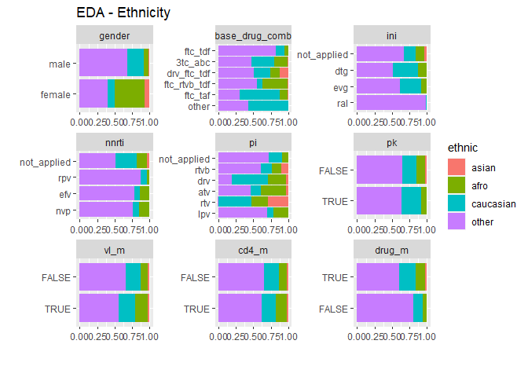<!-- -->

``` r
hiv %>% plot_bar(by = 'gender', nrow = 4, title = 'EDA - Gender')
```

<!-- -->

``` r
hiv %>% plot_bar(by = 'base_drug_comb', nrow = 4, title = 'EDA - Drug Combo')
```

<!-- -->

Let’s move forward to the analysis - let’s relevel some variables for
later analysis.

``` r
# Re-level some variables
hiv$gender <- relevel(hiv$gender, ref = "male")
hiv$ethnic <- relevel(hiv$ethnic, ref = "caucasian")
hiv$base_drug_comb <- relevel(hiv$base_drug_comb, ref = "ftc_tdf")
hiv$ini <- relevel(hiv$ini, ref = "not_applied")
hiv$nnrti <- relevel(hiv$nnrti, ref = "not_applied")
hiv$pi <- relevel(hiv$pi, ref = "not_applied")
```

Let’s separate out each drug into it’s separate binary variables.

Transform the INI, NNRTI, PI variables too.

``` r
# Base drug transformation
hiv_trans <- hiv %>% 
  mutate(ftc = fifelse(grepl('ftc', base_drug_comb), 1, 0),
         tdf = fifelse(grepl('tdf', base_drug_comb), 1, 0),
         tc3 = fifelse(grepl('3tc', base_drug_comb), 1, 0),
         abc = fifelse(grepl('abc', base_drug_comb), 1, 0),
         taf = fifelse(grepl('taf', base_drug_comb), 1, 0),
         drv_base = fifelse(grepl('drv', base_drug_comb), 1, 0),
         rtvb_base = fifelse(grepl('rtvb', base_drug_comb), 1, 0),
         other_base = fifelse(grepl('other', base_drug_comb), 1, 0))

# INI drug transformation
hiv_trans <- hiv_trans %>% 
  mutate(dtg = fifelse(grepl('dtg', ini), 1, 0),
         ral = fifelse(grepl('ral', ini), 1, 0),
         evg = fifelse(grepl('evg', ini), 1, 0),
         ini_not_applied = fifelse(grepl('not_applied', ini), 1, 0))

# NNTRI drug transformation
hiv_trans <- hiv_trans %>% 
  mutate(nvp = fifelse(grepl('nvp', nnrti), 1, 0),
         efv = fifelse(grepl('efv', nnrti), 1, 0),
         rpv = fifelse(grepl('rpv', nnrti), 1, 0),
         nnrti_not_applied = fifelse(grepl('not_applied', nnrti), 1, 0))

# PI drug transformation
hiv_trans <- hiv_trans %>% 
  mutate(drv_extra_pi = fifelse(grepl('drv', pi), 1, 0),
         rtvb_extra_pi = fifelse(grepl('rtvb', pi), 1, 0),
         lpv = fifelse(grepl('lpv', pi), 1, 0),
         rtv = fifelse(grepl('rtv', pi), 1, 0),
         atv = fifelse(grepl('atv', pi), 1, 0),
         pi_not_applied = fifelse(grepl('not_applied', pi), 1, 0))
```

Let’s extract the NTRI regimen from the base drug combination.

``` r
# Extract NRTI regimen
hiv_trans <- hiv_trans %>% 
  mutate(nrti_regimen = case_when(base_drug_comb %like% '3tc' ~ '3tc + abc',
                                  base_drug_comb %like% 'taf' ~ 'ftc + taf',
                                  base_drug_comb %like% 'tdf' ~ 'ftc + tdf',
                                  .default = 'other'))
```

Let’s extract the PI regimen - regardless whether it’s administered as
part of the base regimen or as extra PI.

``` r
# Extract PI regimen
pi_cols <- c("drv_base", "rtvb_base", "drv_extra_pi", "rtvb_extra_pi", "lpv", "atv", "rtv")

hiv_trans <- hiv_trans %>% 
  mutate(pi_regimen = apply(hiv_trans[, ..pi_cols], 1, function(row) {
    
    # Get column names with 1 values
    pi_columns <- names(row[row == 1])
    
    # Replace "DRV_base" with "DRV" in the column names
    pi_columns <- gsub("drv_base", "drv", pi_columns)
    
    # Replace "DRV_extra_pi" with "DRV" in the column names
    pi_columns <- gsub("drv_extra_pi", "drv", pi_columns)
    
    # Replace "RTVB_base" with "RTVB" in the column names
    pi_columns <- gsub("rtvb_base", "rtvb", pi_columns)
    
    # Replace "RTVB_extra_pi" with "RTVB" in the column names
    pi_columns <- gsub("rtvb_extra_pi", "rtvb", pi_columns)
    
    # De-duplicate pi_columns (as DRV and RTVB may appear more than once)
    pi_columns <- unique(pi_columns)
    
    # Concatenate column names with pluses in between
    regimen <- paste(pi_columns, collapse = " + ")
    
    #Return the PI regimen
    ifelse(regimen == "", "none", regimen)
  }))
```

Let’s extract the INI regimen

``` r
# Extract INI regimen
ini_cols <- c("evg", "dtg", "ral")

hiv_trans <- hiv_trans %>% 
  mutate(ini_regimen = apply(hiv_trans[, ..ini_cols], 1, function(row) {
      
    # Get column names with 1 values
    ini_columns <- names(row[row == 1])
    
    # Concatenate column names with pluses in between
    regimen <- paste(ini_columns, collapse = " + ")
    
    # Return the INI regimen
    ifelse(regimen == "", "none", regimen)
  }))
```

Let’s extract the NNRTI regimen.

``` r
# Extract NNRTI regimen
nnrti_cols <- c("nvp", "efv", "rpv")

hiv_trans <- hiv_trans %>% 
  mutate(nnrti_regimen = apply(hiv_trans[, ..nnrti_cols], 1, function(row) {
  
    #Get column names with 1 values
    nnrti_columns <- names(row[row == 1])
    
    #Concatenate column names with pluses in between
    regimen <- paste(nnrti_columns, collapse = " + ")
    
    #Return the NRTI regimen
    ifelse(regimen == "", "none", regimen)
  }))
```

Now, we want to extract all the useful columns that we’ll use for the
analysis.

``` r
# Extract useful columns
cols_keep = c('id', 'time', 'vl', 'cd4', 'relcd4', 'gender', 'ethnic', 
              'nrti_regimen', 'pi_regimen', 'ini_regimen', 'nnrti_regimen', 'pk', 
              'vl_m', 'cd4_m', 'drug_m')

hiv_cleaned <- hiv_trans[, ..cols_keep]

# Save the processed data frame
fwrite(hiv_cleaned, file.path('output', "processed_data_hiv.csv"))
```

Factorise the non-factor columns of the cleaned dataset.

``` r
# Factorise columns and level based on decreasing frequency
factor_cols <- hiv_cleaned %>% select(nrti_regimen:drug_m) %>% names()
hiv_cleaned[, (factor_cols) := lapply(.SD, factor), .SDcols = factor_cols]
hiv_cleaned[, (factor_cols) := lapply(.SD, fct_infreq), .SDcols = factor_cols]

str(hiv_cleaned)
```

    ## Classes 'data.table' and 'data.frame':   534960 obs. of  15 variables:
    ##  $ id           : int  0 0 0 0 0 0 0 0 0 0 ...
    ##  $ time         : int  0 1 2 3 4 5 6 7 8 9 ...
    ##  $ vl           : num  29.9 29.2 28.7 28.1 28.8 ...
    ##  $ cd4          : num  793 467 465 692 642 ...
    ##  $ relcd4       : num  30.8 30.4 30.4 30.2 29.9 ...
    ##  $ gender       : Factor w/ 2 levels "male","female": 1 1 1 1 1 1 1 1 1 1 ...
    ##  $ ethnic       : Factor w/ 4 levels "caucasian","asian",..: 1 1 1 1 1 1 1 1 1 1 ...
    ##  $ nrti_regimen : Factor w/ 4 levels "ftc + tdf","3tc + abc",..: 1 1 1 1 1 1 1 1 1 1 ...
    ##  $ pi_regimen   : Factor w/ 13 levels "none","drv + rtvb + rtv",..: 1 1 1 1 1 1 1 1 1 1 ...
    ##  $ ini_regimen  : Factor w/ 4 levels "none","dtg","evg",..: 2 2 2 2 2 2 2 2 2 2 ...
    ##  $ nnrti_regimen: Factor w/ 4 levels "none","rpv","efv",..: 1 1 1 1 1 1 1 1 1 1 ...
    ##  $ pk           : Factor w/ 2 levels "FALSE","TRUE": 1 1 1 1 1 1 1 1 1 1 ...
    ##  $ vl_m         : Factor w/ 2 levels "FALSE","TRUE": 1 1 1 1 1 1 1 1 1 1 ...
    ##  $ cd4_m        : Factor w/ 2 levels "FALSE","TRUE": 2 1 1 1 1 1 1 2 1 1 ...
    ##  $ drug_m       : Factor w/ 2 levels "TRUE","FALSE": 1 1 1 1 1 1 1 1 1 1 ...
    ##  - attr(*, ".internal.selfref")=<externalptr>

# Start analysis proper

Let’s first look at how many people changed their regimen?

``` r
# How many patients change their regimen at least once?
npatient_regimen_change <- hiv_cleaned[, .N, by = .(id, nrti_regimen, pi_regimen, ini_regimen, nnrti_regimen, pk)][, .(n_regimens = .N), by = id][n_regimens > 1, .N]

# Total number of patients
npatients <- hiv_cleaned[, uniqueN(id)]

c('total unique patients' = npatients, 'patients with regimen changes' = npatient_regimen_change)
```

    ##         total unique patients patients with regimen changes 
    ##                          8916                          5691

Out of 8916, 5691 changed regiments, representing 63.8290713% of the
cohort

As we are investigating both viral load and immune recovery outcomes,
split dataset to 1) people over 1000 VL at time zero and 2) people below
500 CD4 at time zero.

``` r
# Get our VL dataset by getting unique patients who started with >1000 VL at time 0
vl_id <- hiv_cleaned[vl > 1000 & time == 0, unique(id)]
vl <- hiv_cleaned[id %in% vl_id]

# Get our CD4 dataset by getting unique patients who started with <500 CD4 at time 0
cd4_id <- hiv_cleaned[cd4 < 500 & time == 0, unique(id)]
cd4 <- hiv_cleaned[id %in% cd4_id]
```

Now we want to restrict the dataset so the dataset only contains rows
for each patient up to their censor/first_event timepoint.

``` r
# Give outcomes and mark timing for when the event occurred
vl[, `:=`(event = vl <= 1000, event_timing = ifelse(vl <= 1000, time, 59))]
cd4[, `:=`(event = cd4 >= 500, event_timing = ifelse(cd4 >= 500, time, 59))]

# Now for each patient, grab their first event timing
vl_first_event <- vl[, .(first_event = min(event_timing)), by = id]
cd4_first_event <- cd4[, .(first_event = min(event_timing)), by = id]

# Create trimmed dataset
vl_trim <- vl %>% 
  left_join(vl_first_event, by = 'id') %>% 
  filter(time <= first_event) %>% 
  select(-event_timing)

cd4_trim <- cd4 %>% 
  left_join(cd4_first_event, by = 'id') %>% 
  filter(time <= first_event) %>% 
  select(-event_timing)
```

Create an input dataset for modelling involving start-end date for each
patient and their treatment regimen. For details, see comments in code
below.

``` r
# Get distinct episodes for each patient
# `episode_cumu` column only stays the same if there are no patient changes nor treatment regimen changes  
vl_episode <- vl_trim %>% 
  mutate(episode = fifelse(id == lag(id, default = first(id)) 
                           & nrti_regimen == lag(nrti_regimen, default = first(nrti_regimen))
                           & pi_regimen == lag(pi_regimen, default = first(pi_regimen))
                           & ini_regimen == lag(ini_regimen, default = first(ini_regimen))
                           & nnrti_regimen == lag(nnrti_regimen, default = first(nnrti_regimen))
                           & pk == lag(pk, default = first(pk)),
                           0, 1),
         episode_cumu = cumsum(episode)
         )

# Getting start and stop times for each independent episode
splits <- vl_episode[, .(start = min(time), time = max(time)), by = .(id, episode_cumu)]

# Inner join so that everyone only has rows indicating the start and end timepoint of each distinct episode
vl_final <- vl_episode %>% 
  inner_join(splits, by = c('id', 'time', 'episode_cumu')) %>% 
  mutate(stop = time) %>% 
  select(-episode, -episode_cumu)

# Since current censoring timepoint is the timepoint immediate prior to change, 
# we want to increment current stop timepoint by 1 to indicate the actual censoring timepoint 
vl_final[, stop := stop + 1]

# Of course, we don't want to increment the ultimate censoring timepoint at which
# people reached the event or past timepoint 59.
# Thus we limit max stop point to the timepoint of ultimate patient censoring 
vl_final[, stop := fifelse(stop > first_event, first_event, stop)]

# Re-create event flag to align against new stop date
# See patient ID 2 as example
# Patient 2 reached <1000 VL at time 37
# However at the same timepoint they also changed PI regimens
# Now, does their regimen change count as a line?
# It shouldn't since we're assuming that he reached <1000 VL at timepoint 37
# before he changed medication 
# Thus we'd keep his first regimen but discard his second
# This is the purpose of the code below for creating new flag then dedupe
vl_final <- vl_final[, event := fifelse(stop == first_event, TRUE, FALSE)] %>% 
  distinct(id, event, .keep_all = TRUE)
```

Repeat the same process for the CD4 model.

``` r
# For more details see code above 
cd4_episode <- cd4_trim %>% 
  mutate(episode = fifelse(id == lag(id, default = first(id)) 
                           & nrti_regimen == lag(nrti_regimen, default = first(nrti_regimen))
                           & pi_regimen == lag(pi_regimen, default = first(pi_regimen))
                           & ini_regimen == lag(ini_regimen, default = first(ini_regimen))
                           & nnrti_regimen == lag(nnrti_regimen, default = first(nnrti_regimen))
                           & pk == lag(pk, default = first(pk)),
                           0, 1),
         episode_cumu = cumsum(episode)
         )


splits <- cd4_episode[, .(start = min(time), time = max(time)), by = .(id, episode_cumu)]


cd4_final <- cd4_episode %>% 
  inner_join(splits, by = c('id', 'time', 'episode_cumu')) %>% 
  mutate(stop = time) %>% 
  select(-episode, -episode_cumu)

cd4_final[, stop := stop + 1]

cd4_final[, stop := fifelse(stop > first_event, first_event, stop)]

cd4_final <- cd4_final[, event := fifelse(stop == first_event, TRUE, FALSE)] %>% 
  distinct(id, event, .keep_all = TRUE)
```

# Build Cox model

Let’s build a time-varying Cox model starting with the viral load model.

``` r
# Build time-varying Cox model for VL
vl_mod <- coxph(Surv(start, stop, event) ~ relcd4 + gender + ethnic + nrti_regimen + pi_regimen + ini_regimen + nnrti_regimen + pk + cluster(id), data = vl_final)

# Display results
results <- tidy(vl_mod, conf.int = TRUE, exp = T) 
results %>% fwrite(file.path('output', 'vl_results.csv'))
summary(vl_mod)
```

    ## Call:
    ## coxph(formula = Surv(start, stop, event) ~ relcd4 + gender + 
    ##     ethnic + nrti_regimen + pi_regimen + ini_regimen + nnrti_regimen + 
    ##     pk, data = vl_final, cluster = id)
    ## 
    ##   n= 7620, number of events= 5612 
    ## 
    ##                                  coef  exp(coef)   se(coef)  robust se       z
    ## relcd4                     -0.0110282  0.9890324  0.0007782  0.0009019 -12.228
    ## genderfemale               -0.3657362  0.6936858  0.0481698  0.0494311  -7.399
    ## ethnicasian                        NA         NA  0.0000000  0.0000000      NA
    ## ethnicafro                 -0.2095195  0.8109738  0.0644134  0.0731533  -2.864
    ## ethnicother                -0.1823899  0.8332764  0.0383731  0.0533101  -3.421
    ## nrti_regimen3tc + abc       0.0259530  1.0262927  0.0560580  0.0739563   0.351
    ## nrti_regimenftc + taf      -1.6094455  0.1999985  1.0104805  0.1863566  -8.636
    ## nrti_regimenother           1.3802433  3.9758687  0.5809492  0.7114529   1.940
    ## pi_regimendrv + rtvb + rtv -0.1049710  0.9003507  0.0840458  0.1162853  -0.903
    ## pi_regimendrv               0.7023810  2.0185531  0.0767125  0.1161284   6.048
    ## pi_regimenrtvb + atv        0.4455141  1.5612926  0.0911186  0.1172093   3.801
    ## pi_regimendrv + rtv        -1.4257692  0.2403235  0.1539320  0.1516462  -9.402
    ## pi_regimenrtvb + rtv        0.7115639  2.0371748  0.1424296  0.2879288   2.471
    ## pi_regimenatv               0.0388032  1.0395659  0.3852908  0.3127791   0.124
    ## pi_regimenrtvb              1.0814789  2.9490377  0.1063965  0.1302819   8.301
    ## pi_regimendrv + atv        -0.1038449  0.9013651  0.2254569  0.3486494  -0.298
    ## pi_regimenlpv               2.3170510 10.1457102  0.3855227  0.2221408  10.431
    ## pi_regimenrtv                      NA         NA  0.0000000  0.0000000      NA
    ## pi_regimenrtvb + lpv        1.9366630  6.9355686  0.5831523  0.4478489   4.324
    ## pi_regimendrv + lpv                NA         NA  0.0000000  0.0000000      NA
    ## ini_regimendtg             -1.0702260  0.3429310  0.0784518  0.1071575  -9.987
    ## ini_regimenevg             -0.2787908  0.7566982  0.1117373  0.1409810  -1.978
    ## ini_regimenral             -0.8059594  0.4466592  0.0758281  0.0951570  -8.470
    ## nnrti_regimenrpv           -0.1764029  0.8382802  0.0741950  0.1025486  -1.720
    ## nnrti_regimenefv            0.1545334  1.1671132  0.0797417  0.1053359   1.467
    ## nnrti_regimennvp            0.1433580  1.1541430  0.1054996  0.1107814   1.294
    ## pkTRUE                     -0.5443110  0.5802414  0.1068464  0.1233805  -4.412
    ##                            Pr(>|z|)    
    ## relcd4                      < 2e-16 ***
    ## genderfemale               1.37e-13 ***
    ## ethnicasian                      NA    
    ## ethnicafro                 0.004182 ** 
    ## ethnicother                0.000623 ***
    ## nrti_regimen3tc + abc      0.725646    
    ## nrti_regimenftc + taf       < 2e-16 ***
    ## nrti_regimenother          0.052375 .  
    ## pi_regimendrv + rtvb + rtv 0.366684    
    ## pi_regimendrv              1.46e-09 ***
    ## pi_regimenrtvb + atv       0.000144 ***
    ## pi_regimendrv + rtv         < 2e-16 ***
    ## pi_regimenrtvb + rtv       0.013462 *  
    ## pi_regimenatv              0.901268    
    ## pi_regimenrtvb              < 2e-16 ***
    ## pi_regimendrv + atv        0.765818    
    ## pi_regimenlpv               < 2e-16 ***
    ## pi_regimenrtv                    NA    
    ## pi_regimenrtvb + lpv       1.53e-05 ***
    ## pi_regimendrv + lpv              NA    
    ## ini_regimendtg              < 2e-16 ***
    ## ini_regimenevg             0.047984 *  
    ## ini_regimenral              < 2e-16 ***
    ## nnrti_regimenrpv           0.085398 .  
    ## nnrti_regimenefv           0.142362    
    ## nnrti_regimennvp           0.195644    
    ## pkTRUE                     1.03e-05 ***
    ## ---
    ## Signif. codes:  0 '***' 0.001 '**' 0.01 '*' 0.05 '.' 0.1 ' ' 1
    ## 
    ##                            exp(coef) exp(-coef) lower .95 upper .95
    ## relcd4                        0.9890    1.01109    0.9873    0.9908
    ## genderfemale                  0.6937    1.44157    0.6296    0.7643
    ## ethnicasian                       NA         NA        NA        NA
    ## ethnicafro                    0.8110    1.23309    0.7026    0.9360
    ## ethnicother                   0.8333    1.20008    0.7506    0.9251
    ## nrti_regimen3tc + abc         1.0263    0.97438    0.8878    1.1864
    ## nrti_regimenftc + taf         0.2000    5.00004    0.1388    0.2882
    ## nrti_regimenother             3.9759    0.25152    0.9859   16.0333
    ## pi_regimendrv + rtvb + rtv    0.9004    1.11068    0.7169    1.1308
    ## pi_regimendrv                 2.0186    0.49540    1.6077    2.5345
    ## pi_regimenrtvb + atv          1.5613    0.64049    1.2408    1.9645
    ## pi_regimendrv + rtv           0.2403    4.16106    0.1785    0.3235
    ## pi_regimenrtvb + rtv          2.0372    0.49088    1.1586    3.5819
    ## pi_regimenatv                 1.0396    0.96194    0.5631    1.9191
    ## pi_regimenrtvb                2.9490    0.33909    2.2845    3.8069
    ## pi_regimendrv + atv           0.9014    1.10943    0.4551    1.7851
    ## pi_regimenlpv                10.1457    0.09856    6.5644   15.6808
    ## pi_regimenrtv                     NA         NA        NA        NA
    ## pi_regimenrtvb + lpv          6.9356    0.14418    2.8832   16.6837
    ## pi_regimendrv + lpv               NA         NA        NA        NA
    ## ini_regimendtg                0.3429    2.91604    0.2780    0.4231
    ## ini_regimenevg                0.7567    1.32153    0.5740    0.9975
    ## ini_regimenral                0.4467    2.23884    0.3707    0.5382
    ## nnrti_regimenrpv              0.8383    1.19292    0.6856    1.0249
    ## nnrti_regimenefv              1.1671    0.85681    0.9494    1.4347
    ## nnrti_regimennvp              1.1541    0.86644    0.9289    1.4340
    ## pkTRUE                        0.5802    1.72342    0.4556    0.7390
    ## 
    ## Concordance= 0.676  (se = 0.005 )
    ## Likelihood ratio test= 1703  on 24 df,   p=<2e-16
    ## Wald test            = 1327  on 24 df,   p=<2e-16
    ## Score (logrank) test = 1936  on 24 df,   p=<2e-16,   Robust = 1359  p=<2e-16
    ## 
    ##   (Note: the likelihood ratio and score tests assume independence of
    ##      observations within a cluster, the Wald and robust score tests do not).

``` r
sjPlot::plot_model(vl_mod)
```

    ## Model matrix is rank deficient. Parameters `ethnicasian, pi_regimenrtv,
    ##   pi_regimendrv + lpv` were not estimable.

<!-- -->

``` r
ggsave(file.path('output', 'vl_results_image.png'))
```

    ## Saving 7 x 5 in image

``` r
results
```

    ## # A tibble: 27 × 8
    ##    term      estimate std.error robust.se statistic   p.value conf.low conf.high
    ##    <chr>        <dbl>     <dbl>     <dbl>     <dbl>     <dbl>    <dbl>     <dbl>
    ##  1 relcd4       0.989  0.000778  0.000902   -12.2    2.21e-34    0.987     0.991
    ##  2 genderfe…    0.694  0.0482    0.0494      -7.40   1.37e-13    0.630     0.764
    ##  3 ethnicas…   NA      0         0           NA     NA          NA        NA    
    ##  4 ethnicaf…    0.811  0.0644    0.0732      -2.86   4.18e- 3    0.703     0.936
    ##  5 ethnicot…    0.833  0.0384    0.0533      -3.42   6.23e- 4    0.751     0.925
    ##  6 nrti_reg…    1.03   0.0561    0.0740       0.351  7.26e- 1    0.888     1.19 
    ##  7 nrti_reg…    0.200  1.01      0.186       -8.64   5.80e-18    0.139     0.288
    ##  8 nrti_reg…    3.98   0.581     0.711        1.94   5.24e- 2    0.986    16.0  
    ##  9 pi_regim…    0.900  0.0840    0.116       -0.903  3.67e- 1    0.717     1.13 
    ## 10 pi_regim…    2.02   0.0767    0.116        6.05   1.46e- 9    1.61      2.53 
    ## # ℹ 17 more rows

``` r
vl_mod
```

    ## Call:
    ## coxph(formula = Surv(start, stop, event) ~ relcd4 + gender + 
    ##     ethnic + nrti_regimen + pi_regimen + ini_regimen + nnrti_regimen + 
    ##     pk, data = vl_final, cluster = id)
    ## 
    ##                                  coef  exp(coef)   se(coef)  robust se       z
    ## relcd4                     -0.0110282  0.9890324  0.0007782  0.0009019 -12.228
    ## genderfemale               -0.3657362  0.6936858  0.0481698  0.0494311  -7.399
    ## ethnicasian                        NA         NA  0.0000000  0.0000000      NA
    ## ethnicafro                 -0.2095195  0.8109738  0.0644134  0.0731533  -2.864
    ## ethnicother                -0.1823899  0.8332764  0.0383731  0.0533101  -3.421
    ## nrti_regimen3tc + abc       0.0259530  1.0262927  0.0560580  0.0739563   0.351
    ## nrti_regimenftc + taf      -1.6094455  0.1999985  1.0104805  0.1863566  -8.636
    ## nrti_regimenother           1.3802433  3.9758687  0.5809492  0.7114529   1.940
    ## pi_regimendrv + rtvb + rtv -0.1049710  0.9003507  0.0840458  0.1162853  -0.903
    ## pi_regimendrv               0.7023810  2.0185531  0.0767125  0.1161284   6.048
    ## pi_regimenrtvb + atv        0.4455141  1.5612926  0.0911186  0.1172093   3.801
    ## pi_regimendrv + rtv        -1.4257692  0.2403235  0.1539320  0.1516462  -9.402
    ## pi_regimenrtvb + rtv        0.7115639  2.0371748  0.1424296  0.2879288   2.471
    ## pi_regimenatv               0.0388032  1.0395659  0.3852908  0.3127791   0.124
    ## pi_regimenrtvb              1.0814789  2.9490377  0.1063965  0.1302819   8.301
    ## pi_regimendrv + atv        -0.1038449  0.9013651  0.2254569  0.3486494  -0.298
    ## pi_regimenlpv               2.3170510 10.1457102  0.3855227  0.2221408  10.431
    ## pi_regimenrtv                      NA         NA  0.0000000  0.0000000      NA
    ## pi_regimenrtvb + lpv        1.9366630  6.9355686  0.5831523  0.4478489   4.324
    ## pi_regimendrv + lpv                NA         NA  0.0000000  0.0000000      NA
    ## ini_regimendtg             -1.0702260  0.3429310  0.0784518  0.1071575  -9.987
    ## ini_regimenevg             -0.2787908  0.7566982  0.1117373  0.1409810  -1.978
    ## ini_regimenral             -0.8059594  0.4466592  0.0758281  0.0951570  -8.470
    ## nnrti_regimenrpv           -0.1764029  0.8382802  0.0741950  0.1025486  -1.720
    ## nnrti_regimenefv            0.1545334  1.1671132  0.0797417  0.1053359   1.467
    ## nnrti_regimennvp            0.1433580  1.1541430  0.1054996  0.1107814   1.294
    ## pkTRUE                     -0.5443110  0.5802414  0.1068464  0.1233805  -4.412
    ##                                   p
    ## relcd4                      < 2e-16
    ## genderfemale               1.37e-13
    ## ethnicasian                      NA
    ## ethnicafro                 0.004182
    ## ethnicother                0.000623
    ## nrti_regimen3tc + abc      0.725646
    ## nrti_regimenftc + taf       < 2e-16
    ## nrti_regimenother          0.052375
    ## pi_regimendrv + rtvb + rtv 0.366684
    ## pi_regimendrv              1.46e-09
    ## pi_regimenrtvb + atv       0.000144
    ## pi_regimendrv + rtv         < 2e-16
    ## pi_regimenrtvb + rtv       0.013462
    ## pi_regimenatv              0.901268
    ## pi_regimenrtvb              < 2e-16
    ## pi_regimendrv + atv        0.765818
    ## pi_regimenlpv               < 2e-16
    ## pi_regimenrtv                    NA
    ## pi_regimenrtvb + lpv       1.53e-05
    ## pi_regimendrv + lpv              NA
    ## ini_regimendtg              < 2e-16
    ## ini_regimenevg             0.047984
    ## ini_regimenral              < 2e-16
    ## nnrti_regimenrpv           0.085398
    ## nnrti_regimenefv           0.142362
    ## nnrti_regimennvp           0.195644
    ## pkTRUE                     1.03e-05
    ## 
    ## Likelihood ratio test=1703  on 24 df, p=< 2.2e-16
    ## n= 7620, number of events= 5612

It seems like the cox proportional hazards assumption does not hold for
the VL-model:

``` r
ggcoxzph((cox.zph(vl_mod)))[1]
```

    ## $`1`

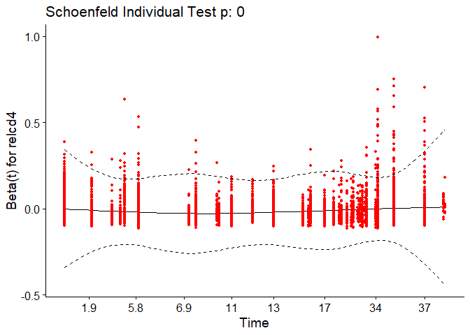<!-- -->

``` r
ggcoxzph((cox.zph(vl_mod)))[2]
```

    ## $`2`

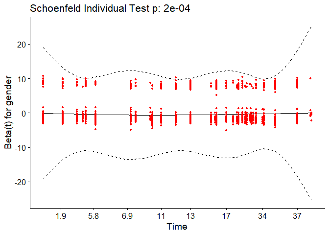<!-- -->

``` r
ggcoxzph((cox.zph(vl_mod)))[3]
```

    ## $`3`

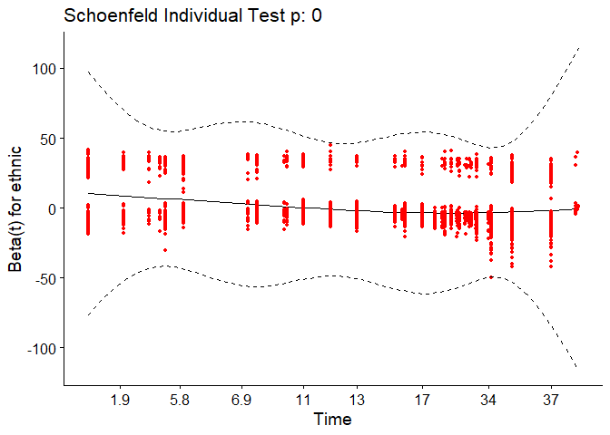<!-- -->

``` r
ggcoxzph((cox.zph(vl_mod)))[4]
```

    ## $`4`

<!-- -->

``` r
ggcoxzph((cox.zph(vl_mod)))[5]
```

    ## $`5`

<!-- -->

``` r
ggcoxzph((cox.zph(vl_mod)))[6]
```

    ## $`6`

<!-- -->

``` r
ggcoxzph((cox.zph(vl_mod)))[7]
```

    ## $`7`

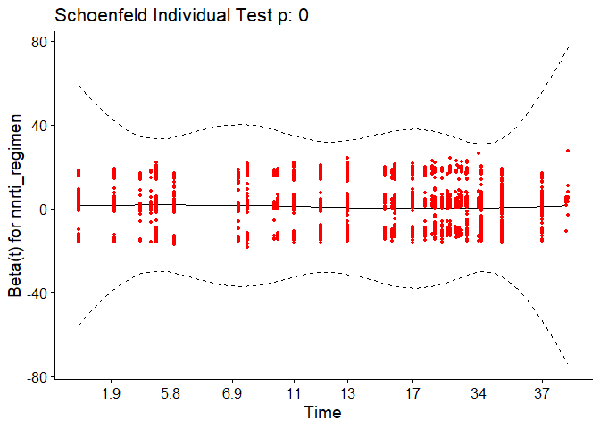<!-- -->

``` r
ggcoxzph((cox.zph(vl_mod)))[8]
```

    ## $`8`

<!-- -->

Let’s build a time-varying Cox model starting with the CD4 model.

``` r
# Build time-varying Cox model for CD4
cd4_mod <- coxph(Surv(start, stop, event) ~ vl + gender + ethnic + nrti_regimen + pi_regimen + ini_regimen + nnrti_regimen + pk + cluster(id), data = cd4_final)

# Display results
results <- tidy(cd4_mod, conf.int = TRUE, exp = T) 
results %>% fwrite(file.path('output', 'cd4_results.csv'))
summary(cd4_mod)
```

    ## Call:
    ## coxph(formula = Surv(start, stop, event) ~ vl + gender + ethnic + 
    ##     nrti_regimen + pi_regimen + ini_regimen + nnrti_regimen + 
    ##     pk, data = cd4_final, cluster = id)
    ## 
    ##   n= 5570, number of events= 3932 
    ## 
    ##                                  coef  exp(coef)   se(coef)  robust se      z
    ## vl                          1.517e-05  1.000e+00  1.389e-06  1.837e-06  8.255
    ## genderfemale                2.072e-02  1.021e+00  6.064e-02  5.662e-02  0.366
    ## ethnicasian                 3.190e-02  1.032e+00  1.882e-01  2.335e-01  0.137
    ## ethnicafro                 -5.579e-01  5.724e-01  8.588e-02  8.999e-02 -6.200
    ## ethnicother                 8.360e-02  1.087e+00  6.532e-02  8.062e-02  1.037
    ## nrti_regimen3tc + abc      -3.195e-01  7.265e-01  6.474e-02  6.584e-02 -4.852
    ## nrti_regimenftc + taf      -9.077e-02  9.132e-01  1.223e-01  9.337e-02 -0.972
    ## nrti_regimenother           6.387e-02  1.066e+00  1.613e-01  1.533e-01  0.417
    ## pi_regimendrv + rtvb + rtv -7.066e-01  4.933e-01  1.003e-01  9.454e-02 -7.474
    ## pi_regimendrv               1.142e-01  1.121e+00  1.105e-01  1.045e-01  1.092
    ## pi_regimenrtvb + atv       -6.799e-03  9.932e-01  1.178e-01  1.222e-01 -0.056
    ## pi_regimendrv + rtv        -1.452e-01  8.648e-01  1.600e-01  1.810e-01 -0.802
    ## pi_regimenrtvb + rtv        6.256e-01  1.869e+00  1.669e-01  2.196e-01  2.849
    ## pi_regimenatv               1.261e+00  3.527e+00  3.164e-01  5.329e-01  2.366
    ## pi_regimenrtvb              1.458e+00  4.296e+00  1.786e-01  1.918e-01  7.601
    ## pi_regimendrv + atv        -2.076e-01  8.125e-01  2.159e-01  2.439e-01 -0.851
    ## pi_regimenlpv               1.147e+00  3.147e+00  3.044e-01  6.537e-01  1.754
    ## pi_regimenrtv               2.273e+00  9.708e+00  7.192e-01  6.996e-01  3.249
    ## pi_regimenrtvb + lpv       -1.190e-01  8.878e-01  7.143e-01  6.839e-01 -0.174
    ## pi_regimendrv + lpv                NA         NA  0.000e+00  0.000e+00     NA
    ## ini_regimendtg              1.287e-01  1.137e+00  1.127e-01  1.081e-01  1.190
    ## ini_regimenevg              5.700e-02  1.059e+00  1.440e-01  1.335e-01  0.427
    ## ini_regimenral             -1.855e-01  8.307e-01  1.160e-01  9.659e-02 -1.920
    ## nnrti_regimenrpv            9.130e-02  1.096e+00  8.984e-02  8.937e-02  1.022
    ## nnrti_regimenefv            2.460e-01  1.279e+00  9.206e-02  9.282e-02  2.650
    ## nnrti_regimennvp            2.792e-01  1.322e+00  1.166e-01  1.127e-01  2.479
    ## pkTRUE                     -2.684e-01  7.646e-01  1.172e-01  1.039e-01 -2.582
    ##                            Pr(>|z|)    
    ## vl                          < 2e-16 ***
    ## genderfemale                0.71437    
    ## ethnicasian                 0.89132    
    ## ethnicafro                 5.64e-10 ***
    ## ethnicother                 0.29975    
    ## nrti_regimen3tc + abc      1.22e-06 ***
    ## nrti_regimenftc + taf       0.33098    
    ## nrti_regimenother           0.67697    
    ## pi_regimendrv + rtvb + rtv 7.80e-14 ***
    ## pi_regimendrv               0.27487    
    ## pi_regimenrtvb + atv        0.95564    
    ## pi_regimendrv + rtv         0.42233    
    ## pi_regimenrtvb + rtv        0.00438 ** 
    ## pi_regimenatv               0.01800 *  
    ## pi_regimenrtvb             2.93e-14 ***
    ## pi_regimendrv + atv         0.39470    
    ## pi_regimenlpv               0.07943 .  
    ## pi_regimenrtv               0.00116 ** 
    ## pi_regimenrtvb + lpv        0.86183    
    ## pi_regimendrv + lpv              NA    
    ## ini_regimendtg              0.23412    
    ## ini_regimenevg              0.66935    
    ## ini_regimenral              0.05485 .  
    ## nnrti_regimenrpv            0.30696    
    ## nnrti_regimenefv            0.00805 ** 
    ## nnrti_regimennvp            0.01319 *  
    ## pkTRUE                      0.00981 ** 
    ## ---
    ## Signif. codes:  0 '***' 0.001 '**' 0.01 '*' 0.05 '.' 0.1 ' ' 1
    ## 
    ##                            exp(coef) exp(-coef) lower .95 upper .95
    ## vl                            1.0000     1.0000    1.0000    1.0000
    ## genderfemale                  1.0209     0.9795    0.9137    1.1408
    ## ethnicasian                   1.0324     0.9686    0.6533    1.6315
    ## ethnicafro                    0.5724     1.7471    0.4798    0.6828
    ## ethnicother                   1.0872     0.9198    0.9283    1.2733
    ## nrti_regimen3tc + abc         0.7265     1.3764    0.6385    0.8266
    ## nrti_regimenftc + taf         0.9132     1.0950    0.7605    1.0966
    ## nrti_regimenother             1.0660     0.9381    0.7893    1.4396
    ## pi_regimendrv + rtvb + rtv    0.4933     2.0270    0.4099    0.5938
    ## pi_regimendrv                 1.1209     0.8921    0.9132    1.3758
    ## pi_regimenrtvb + atv          0.9932     1.0068    0.7817    1.2621
    ## pi_regimendrv + rtv           0.8648     1.1563    0.6066    1.2331
    ## pi_regimenrtvb + rtv          1.8694     0.5349    1.2157    2.8746
    ## pi_regimenatv                 3.5273     0.2835    1.2413   10.0232
    ## pi_regimenrtvb                4.2960     0.2328    2.9501    6.2559
    ## pi_regimendrv + atv           0.8125     1.2308    0.5037    1.3106
    ## pi_regimenlpv                 3.1473     0.3177    0.8740   11.3331
    ## pi_regimenrtv                 9.7085     0.1030    2.4639   38.2545
    ## pi_regimenrtvb + lpv          0.8878     1.1264    0.2324    3.3920
    ## pi_regimendrv + lpv               NA         NA        NA        NA
    ## ini_regimendtg                1.1373     0.8793    0.9201    1.4058
    ## ini_regimenevg                1.0587     0.9446    0.8150    1.3752
    ## ini_regimenral                0.8307     1.2038    0.6874    1.0039
    ## nnrti_regimenrpv              1.0956     0.9127    0.9196    1.3053
    ## nnrti_regimenefv              1.2788     0.7820    1.0661    1.5340
    ## nnrti_regimennvp              1.3221     0.7564    1.0602    1.6487
    ## pkTRUE                        0.7646     1.3078    0.6237    0.9374
    ## 
    ## Concordance= 0.67  (se = 0.006 )
    ## Likelihood ratio test= 658.4  on 26 df,   p=<2e-16
    ## Wald test            = 735.3  on 26 df,   p=<2e-16
    ## Score (logrank) test = 754  on 26 df,   p=<2e-16,   Robust = 554.1  p=<2e-16
    ## 
    ##   (Note: the likelihood ratio and score tests assume independence of
    ##      observations within a cluster, the Wald and robust score tests do not).

``` r
sjPlot::plot_model(cd4_mod)
```

    ## Model matrix is rank deficient. Parameters `pi_regimendrv + lpv` were
    ##   not estimable.

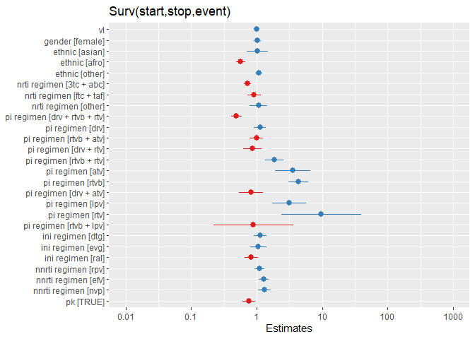<!-- -->

``` r
ggsave(file.path('output', 'cd4_results_image.png'))
```

    ## Saving 7 x 5 in image

``` r
results
```

    ## # A tibble: 27 × 8
    ##    term       estimate std.error robust.se statistic  p.value conf.low conf.high
    ##    <chr>         <dbl>     <dbl>     <dbl>     <dbl>    <dbl>    <dbl>     <dbl>
    ##  1 vl            1.00    1.39e-6   1.84e-6     8.25  1.52e-16    1.00      1.00 
    ##  2 genderfem…    1.02    6.06e-2   5.66e-2     0.366 7.14e- 1    0.914     1.14 
    ##  3 ethnicasi…    1.03    1.88e-1   2.33e-1     0.137 8.91e- 1    0.653     1.63 
    ##  4 ethnicafro    0.572   8.59e-2   9.00e-2    -6.20  5.64e-10    0.480     0.683
    ##  5 ethnicoth…    1.09    6.53e-2   8.06e-2     1.04  3.00e- 1    0.928     1.27 
    ##  6 nrti_regi…    0.727   6.47e-2   6.58e-2    -4.85  1.22e- 6    0.639     0.827
    ##  7 nrti_regi…    0.913   1.22e-1   9.34e-2    -0.972 3.31e- 1    0.760     1.10 
    ##  8 nrti_regi…    1.07    1.61e-1   1.53e-1     0.417 6.77e- 1    0.789     1.44 
    ##  9 pi_regime…    0.493   1.00e-1   9.45e-2    -7.47  7.80e-14    0.410     0.594
    ## 10 pi_regime…    1.12    1.10e-1   1.05e-1     1.09  2.75e- 1    0.913     1.38 
    ## # ℹ 17 more rows

It seems like the cox proportional hazards assumption does not hold also
for the CD4-model:

``` r
ggcoxzph((cox.zph(cd4_mod)))[1]
```

    ## $`1`

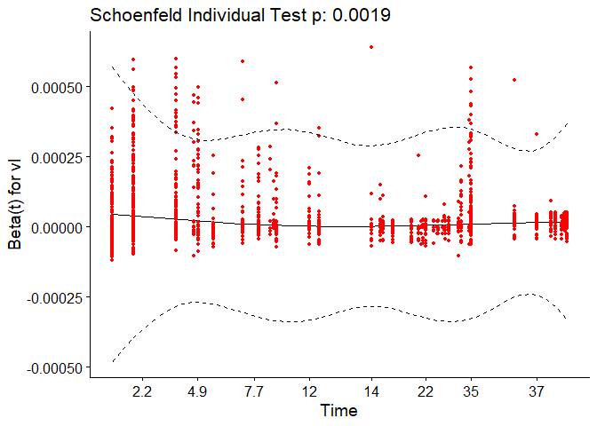<!-- -->

``` r
ggcoxzph((cox.zph(cd4_mod)))[2]
```

    ## $`2`

<!-- -->

``` r
ggcoxzph((cox.zph(cd4_mod)))[3]
```

    ## $`3`

<!-- -->

``` r
ggcoxzph((cox.zph(cd4_mod)))[4]
```

    ## $`4`

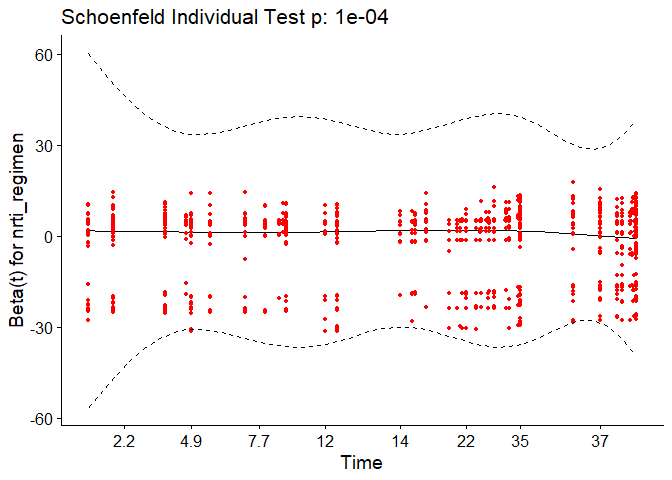<!-- -->

``` r
ggcoxzph((cox.zph(cd4_mod)))[5]
```

    ## $`5`

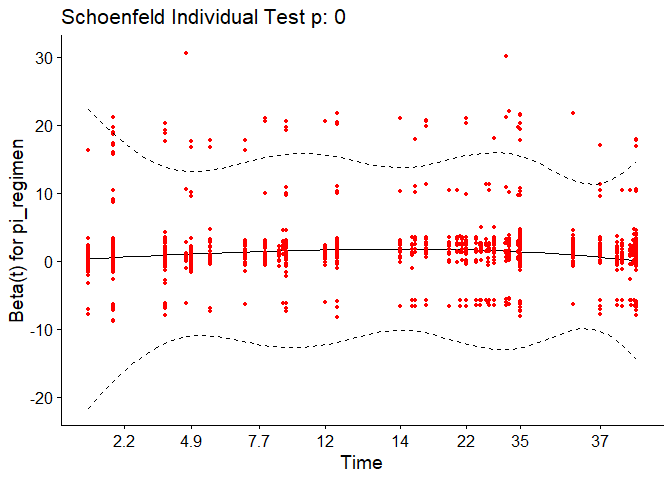<!-- -->

``` r
ggcoxzph((cox.zph(cd4_mod)))[6]
```

    ## $`6`

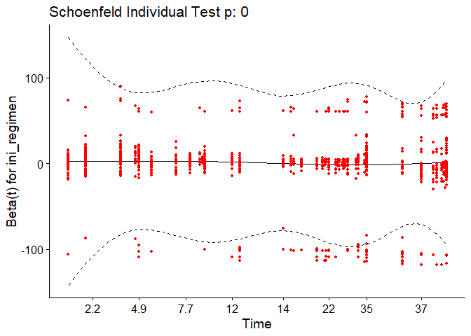<!-- -->

``` r
ggcoxzph((cox.zph(cd4_mod)))[7]
```

    ## $`7`

<!-- -->

``` r
ggcoxzph((cox.zph(cd4_mod)))[8]
```

    ## $`8`

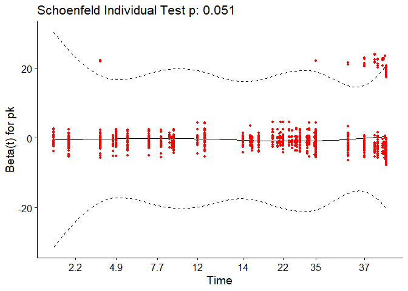<!-- -->

- The only variable for which the cox proportional hazard assumption
  seems to hold is the pk-enhancer variable in both models (although the
  Schoenfeld test is barely non-significant in the CD4-model).
